# LINE to Notion Inbox

LINEに送ったメッセージが、自動でNotionのInboxに登録されるツールです。

```
あなた → LINE → GAS(自動) → Notion DB に登録!
```

## できること

- LINE にテキストを送るだけで Notion DB にページが作られる
- DB が無ければ自動で作成してくれる
- 同じメッセージの二重登録を防止（LineMessageId で判定）
- エラーはスプレッドシートのログシートに自動記録
- GAS のサイドバーから設定・テスト・ログ確認ができる
- プロパティ名（タイトル列名など）は自由にカスタマイズ可能

---

## 使い始めるまでの流れ

全体の仕組みは、LINEから送信されたメッセージがGAS（Google Apps Script）を経由してNotionに登録されるという流れになります。

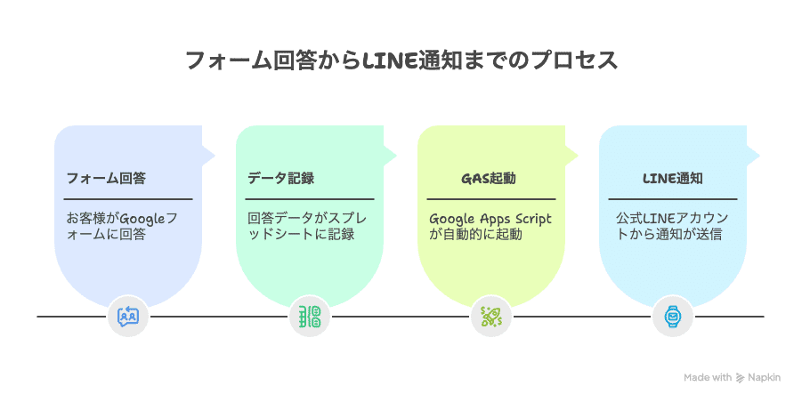

### Step 1: Notion の準備

1. [Notion Integrations](https://www.notion.so/my-integrations) を開く
2. 「New integration」で Internal Integration を作成
3. 表示されるトークン（`ntn_...`）をコピーしておく
4. 使いたい DB またはページを開き、右上「...」→「接続」から今作った Integration を追加

> DB が無い場合は親ページだけ接続すれば OK。初回実行時に自動で DB が作られます。

### Step 2: LINE の準備

LINE Notifyが終了した現在、公式LINE（Messaging API）を利用して通知の仕組みを構築します。詳細な手順は[こちらのnote記事](https://note.com/keitaro_aigc/n/n0caee9312386)でも解説されています。

#### 1. LINE Developersにログイン
まず [LINE Developers](https://developers.line.biz/) にアクセスして、LINEアカウントでログインします。


個人のLINEアカウントでも問題ありませんが、ビジネスアカウントを作成するのがおすすめです。
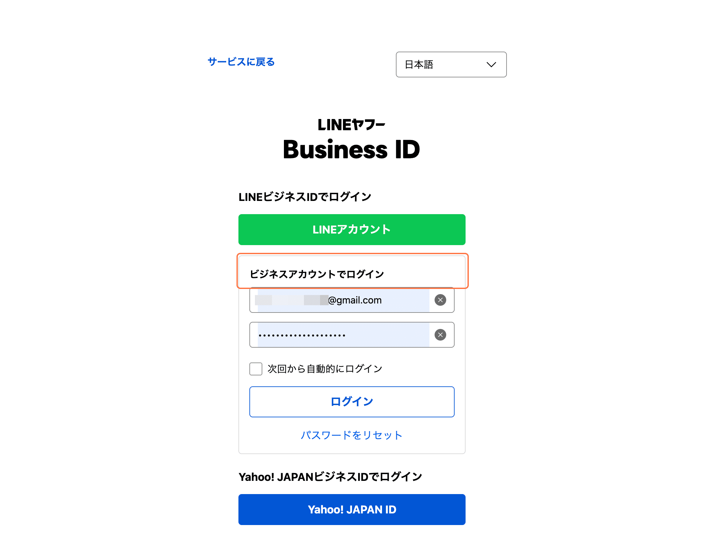

#### 2. プロバイダーとチャネルを作成
プロバイダーを作成します。「作成」をクリックし、任意の名前を入力します。
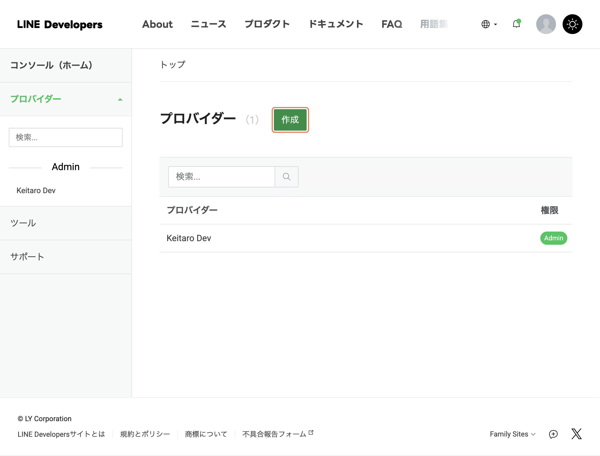
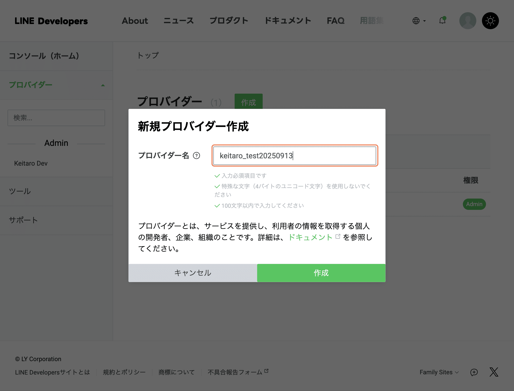

次にチャネルを作成します。「チャネル設定」をクリックし、チャネルの種類は「Messaging API」を選択します。
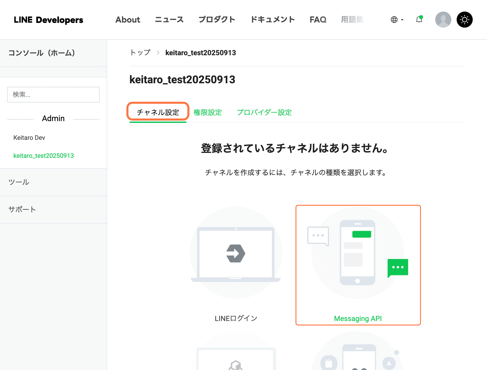

「LINE公式アカウントを作成する」を選択し、アカウント名などを設定します。
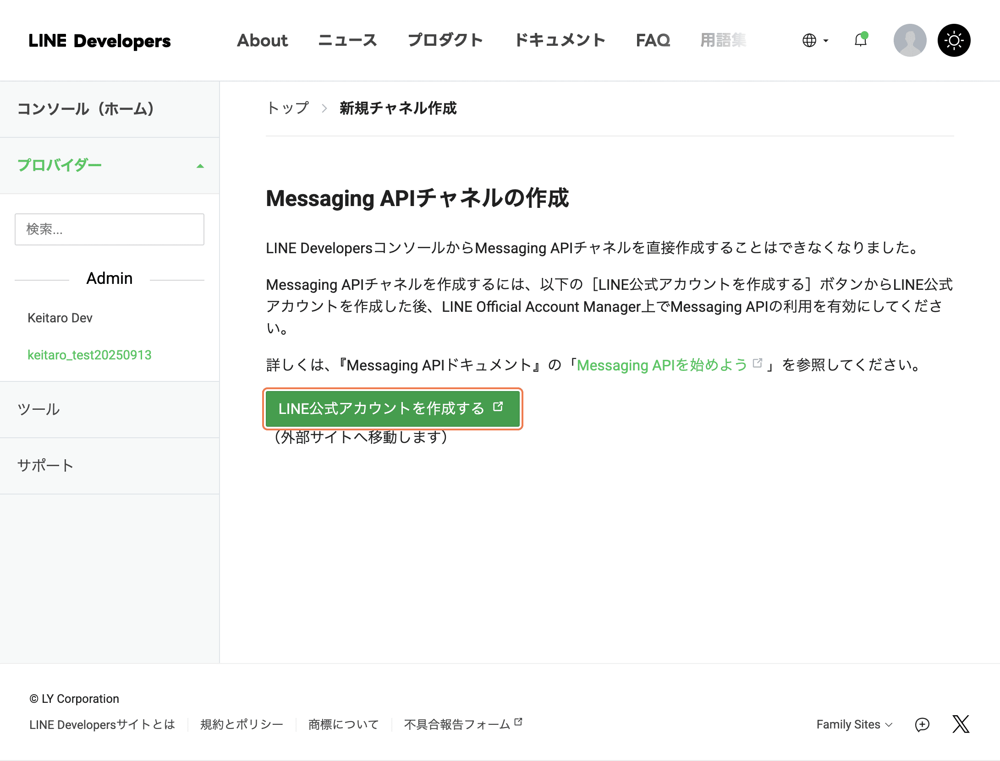
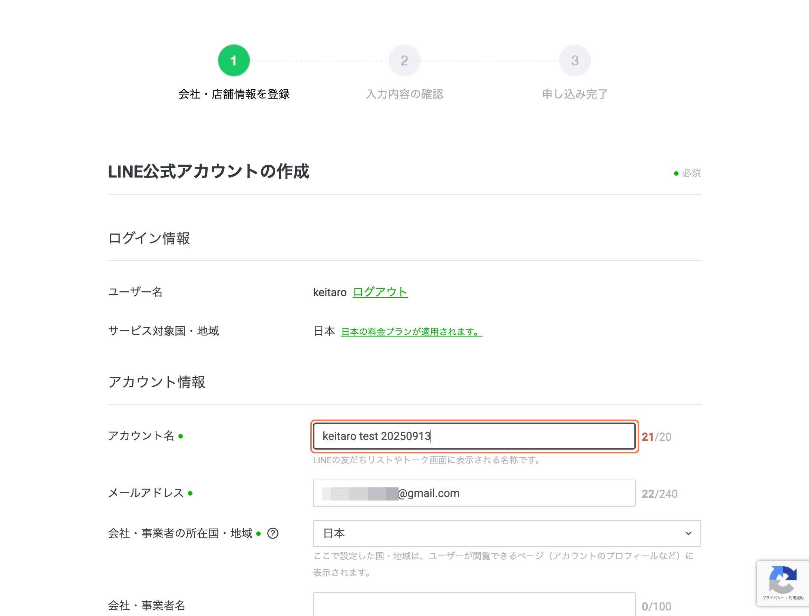

#### 3. 重要な設定項目
チャネルが作成できたら、以下の設定を行います。
- **Webhookの利用**: ONにする
- **応答メッセージ**: OFFにする（Botの自動返信を防ぐため）
- **あいさつメッセージ**: OFFにする

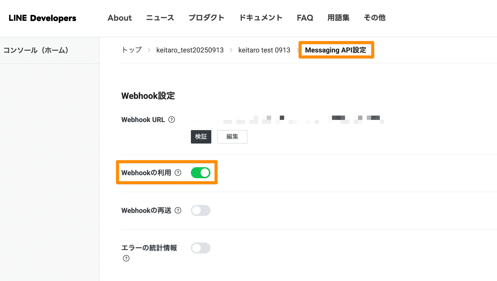
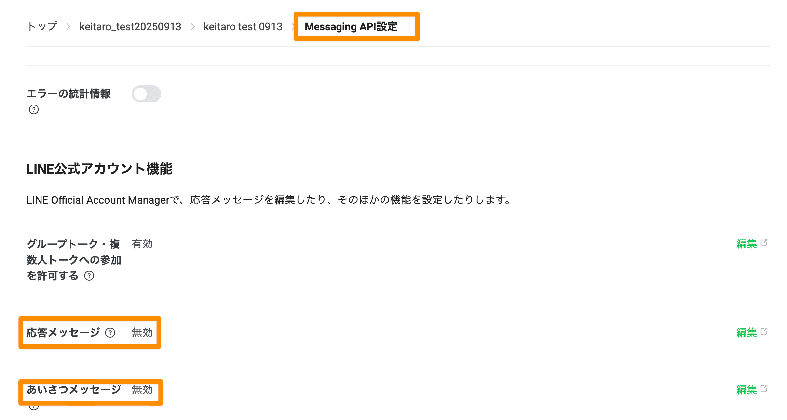

「Messaging API設定」から**チャネルアクセストークン（長期）**を発行し、後でGASで使用するので安全な場所にコピーしておきます。
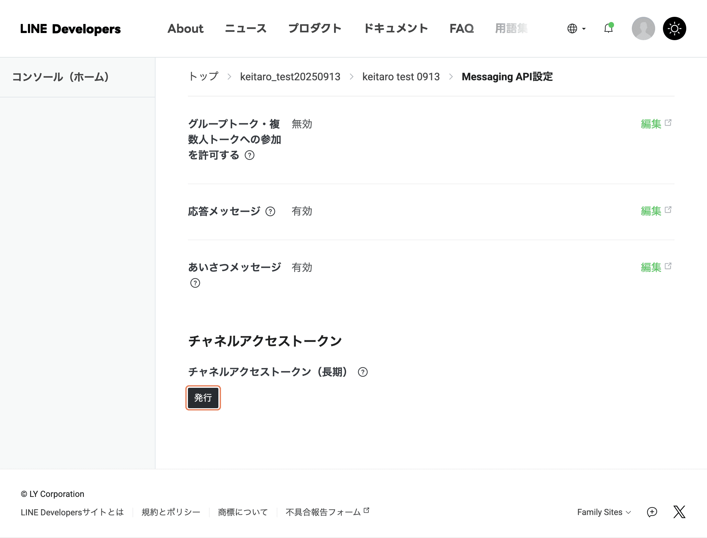

「基本設定」から **Channel Secret** もコピーしておきます。

#### 4. 通知先のID取得方法
LINE通知を送るには、送信先のユーザーIDが必要です。
作成したBotを友だち追加し、何かメッセージを送ります。
Webhook.siteからwebhookを取得し、LINE側からwebhookを設定することでuserIDを取得できます。
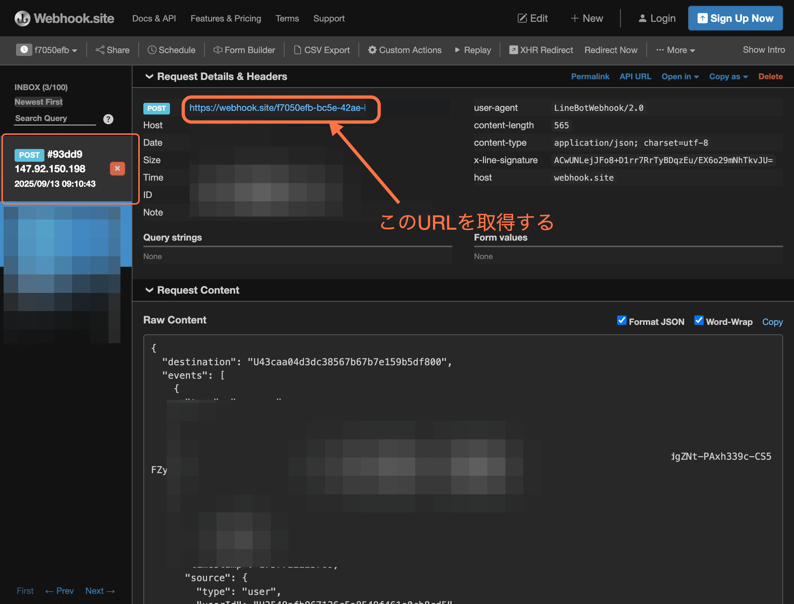
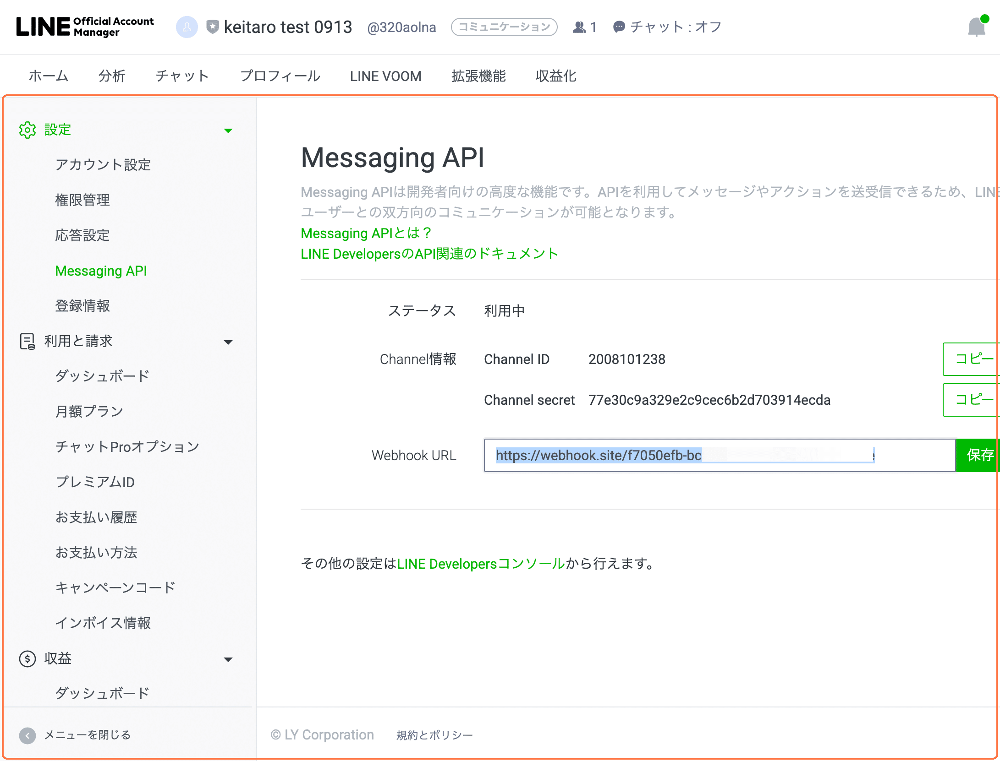
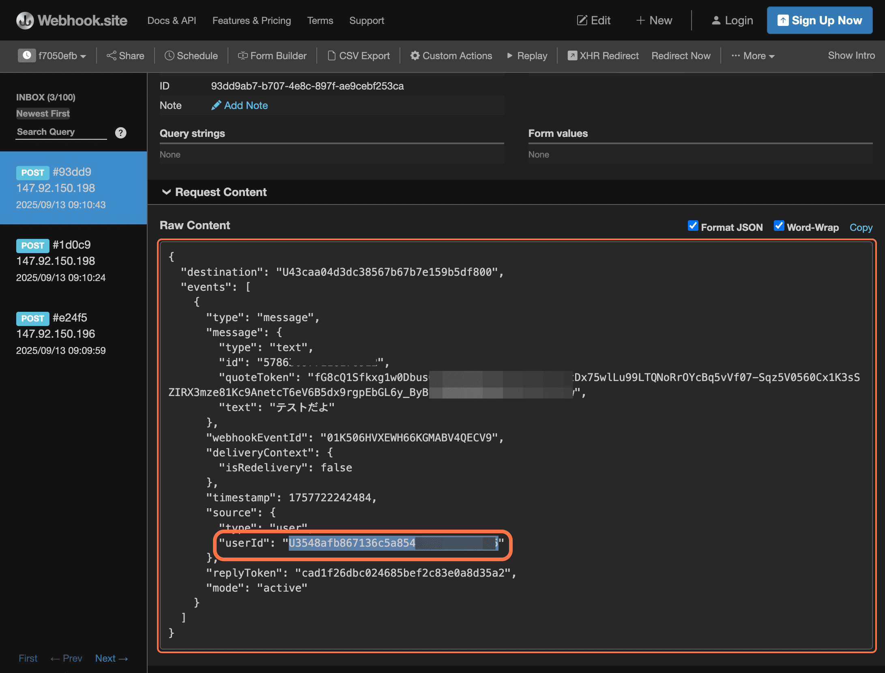

### Step 3: GAS にコードを反映

```bash
# clasp が未インストールなら
npm install -g @google/clasp

# Google アカウントでログイン
clasp login

# コードを GAS にアップロード
clasp push

# GAS エディタを開く
clasp open
```

### Step 4: 初期設定ウィザード

1. GAS に紐づいたスプレッドシートを開く
2. メニュー「**LINE to Notion**」→「**サイドバーを表示**」
3. サイドバーの「**初期設定ウィザード**」をクリック
4. 4ステップで設定を入力：
   - **Step 1** — Notion トークン ＋ DB ID（または親ページ ID）
   - **Step 2** — LINE Channel Secret（＋ Access Token）
   - **Step 3** — プロパティ名の確認・変更
   - **Step 4** — 確認して保存

### Step 5: ウェブアプリとしてデプロイ

1. GAS エディタで「**デプロイ**」→「**新しいデプロイ**」
2. 種類: **ウェブアプリ**
3. 次のユーザーとして実行: **自分**
4. アクセスできるユーザー: **全員**
5. 「デプロイ」を押して、表示される URL をコピー

### Step 6: LINE に Webhook URL を設定

1. LINE Developers → チャネル → 「Messaging API設定」
2. 「Webhook URL」に Step 5 の URL を貼り付け
3. 「Webhook の利用」を **ON** にする

> LINE Developers の「検証」ボタンではエラーが出ますが、実際のメッセージ送信は正常に動きます。（GAS の仕様で初回リダイレクトが返るため）

これで完了です。LINE にテキストを送ると Notion DB に自動登録されます。

---

## コードを更新したとき（重要）

`clasp push` しただけでは **デプロイ済みのウェブアプリには反映されません**。

```
clasp push した後 →
  GAS エディタ > デプロイ > デプロイを管理 > 鉛筆アイコン >
  バージョンを「新バージョン」に変更 > デプロイ
```

これでウェブアプリが新しいコードで動くようになります。

---

## Notion DB のプロパティ

### 必須

| プロパティ | タイプ | 内容 |
|-----------|--------|------|
| `Name`（変更可） | title | LINE メッセージのテキスト |

### オプション（あれば自動セット、なければスキップ）

| プロパティ | タイプ | 自動セット値 |
|-----------|--------|-------------|
| `Status` | select | `Inbox` |
| `Source` | select | `LINE` |
| `CapturedAt` | date | 受信日時（JST） |
| `LineUserId` | rich_text | LINE 送信者 ID |
| `LineMessageId` | rich_text | メッセージ ID（重複排除用） |
| `RawText` | rich_text | 元テキスト全文 |

プロパティ名はウィザードや設定変更画面でいつでも変更できます。

---

## 設定を変更するには

- サイドバー →「**設定変更**」ボタン
- メニュー →「**LINE to Notion**」→「**設定変更**」

タブ切り替え（Notion / LINE / プロパティ）で個別に保存できます。

---

## エラーログ

処理結果は同じスプレッドシート内の「**ErrorLog**」シートに自動記録されます。

| カラム | 内容 |
|--------|------|
| タイムスタンプ | 発生日時（JST） |
| レベル | INFO / WARN / ERROR |
| 関数名 | どの関数で起きたか |
| メッセージID | LINE メッセージ ID |
| ユーザーID | LINE 送信者 ID |
| エラー内容 | 詳細メッセージ |
| ペイロード | リクエスト内容（先頭1000文字） |

サイドバーの「**ログシートを開く**」から直接アクセスできます。

---

## プロジェクト構造

```
src/
├── appsscript.json              # GAS 設定
├── core/
│   ├── Code.gs                  # エントリポイント（doPost, onOpen, UI）
│   └── Config.gs                # 設定定数・プロパティヘルパー
├── integrations/
│   ├── LineWebhook.gs           # LINE イベント解析
│   ├── NotionApi.gs             # Notion API ラッパー
│   └── NotionDatabase.gs        # DB 検証・自動作成
├── modules/
│   ├── DuplicateChecker.gs      # 重複排除
│   ├── ErrorLogger.gs           # スプレッドシートログ
│   └── InboxProcessor.gs        # メイン処理
└── ui/
    ├── Sidebar.html             # サイドバー
    └── dialogs/
        ├── SetupWizard.html     # 初期設定ウィザード
        ├── SettingsDialog.html  # 設定変更
        └── HelpDialog.html      # ヘルプ
```

---

## GitHub Actions による自動デプロイ

`main` ブランチへのプッシュで自動的に GAS へデプロイされます。

### セットアップ

1. [Apps Script API を有効化](https://script.google.com/home/usersettings)
2. clasp 認証情報を取得:
   ```bash
   cat ~/.clasprc.json | base64 | tr -d '\n'
   ```
3. GitHub > Settings > Secrets > `CLASPRC_JSON_BASE64` に貼り付け

---

## 参考リンク

- [Google Apps Script](https://developers.google.com/apps-script)
- [Notion API](https://developers.notion.com/)
- [LINE Messaging API](https://developers.line.biz/ja/docs/messaging-api/)
- [clasp](https://github.com/google/clasp)
- [Googleフォーム × LINE通知 ― まずは「全部通知」から始めよう！｜keitaro_aigc](https://note.com/keitaro_aigc/n/n0caee9312386)
